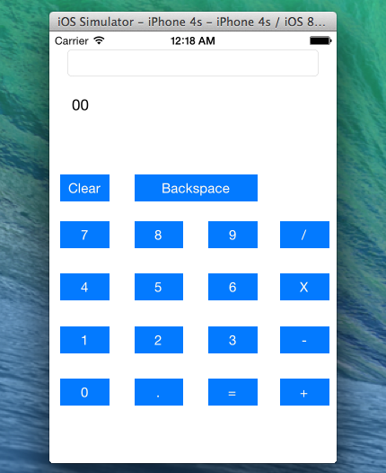

{\rtf1\ansi\ansicpg1252\cocoartf1265\cocoasubrtf200
{\fonttbl\f0\fswiss\fcharset0 Helvetica;}
{\colortbl;\red255\green255\blue255;}
\paperw11900\paperh16840\margl1440\margr1440\vieww19980\viewh12720\viewkind0
\pard\tx566\tx1133\tx1700\tx2267\tx2834\tx3401\tx3968\tx4535\tx5102\tx5669\tx6236\tx6803\pardirnatural

\f0\fs24 \cf0 Simple Calculator using Swift iOS 8 Application\
==================================================\
\
\
\
This is a simple Basic calculator App for IOS 8 using Swift- Apple\'92e new language for iPhone and iOS. \
Application requires xCode 6 and IOS 7 or newer version.\
Feel free to contact me you have any queries.\
\
Thanks\
}